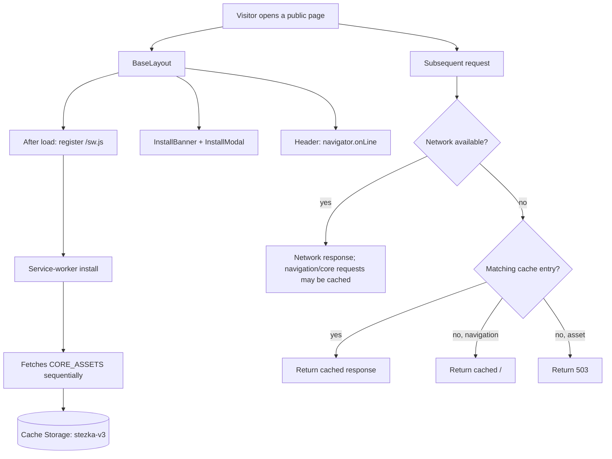
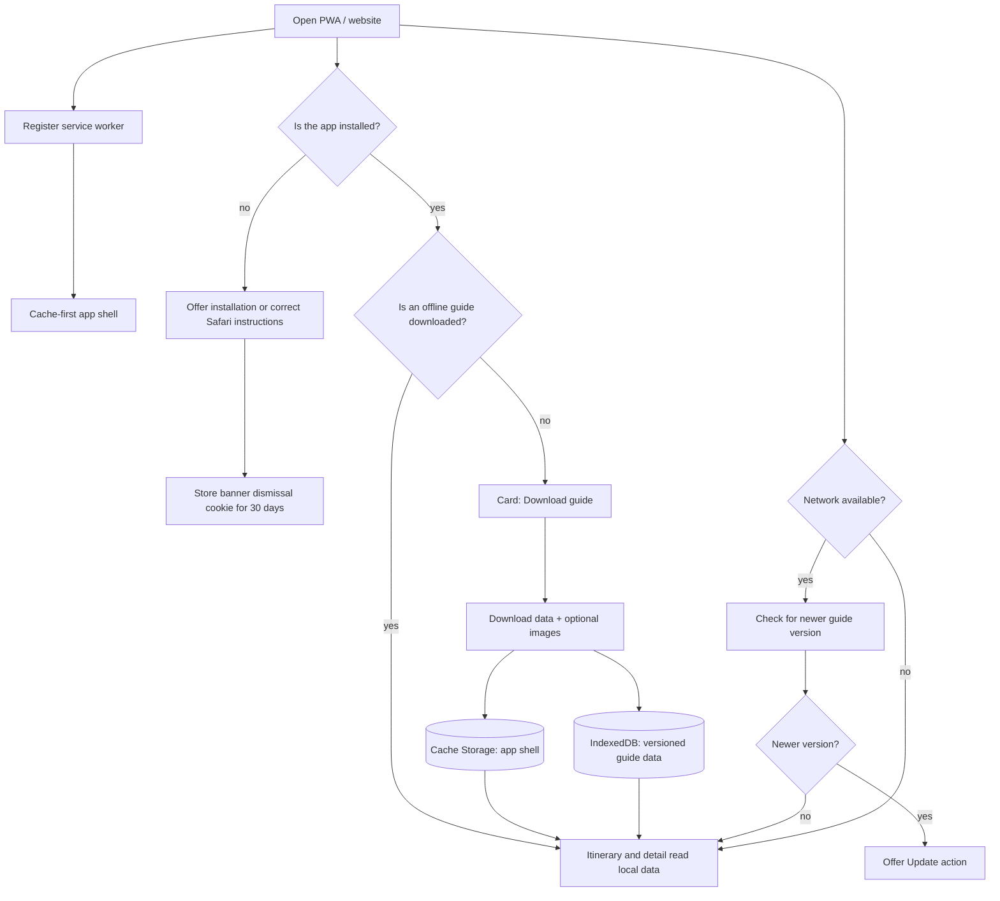

# Offline/PWA: current-state audit and redesign proposal

Audit date: 18 August 2026. This document describes the repository's actual implementation, distinguishes it from the older `offline-pwa.md` proposal, and recommends a replacement design. It does not make application changes.

## Executive summary

The project has the basic PWA pieces—a manifest and a hand-written service worker—but its offline behaviour is not reliable enough to promise users a complete itinerary and every point detail page:

- The service worker is registered from `BaseLayout.astro`. Its current list includes the itinerary, the known filter URLs, and 53 detail-page URLs in `public/sw.js`.
- Those HTML pages are fetched during service-worker installation, but the app's JavaScript, CSS, icons, and detail images are not deliberately cached in the same way. A cached page is therefore not a guarantee of a working offline app.
- `npm run inject`, intended to add detail routes, no longer has its insertion marker in `sw.js`. Running it does not add new detail pages.
- The banner, modal, toasts, and header indicator are four separate mechanisms. They do not share a real “offline guide downloaded” state, and some contain functional defects.
- The manifest references PNG icons that do not exist in `public/icons/`; this can prevent installation in Chrome and Edge.

Recommended direction: keep the PWA, but remove the hand-maintained list of pages and automatic downloading of every detail page during service-worker installation. Once the app is installed—or after an explicit user choice—offer **“Download guide for offline use.”** That action downloads a versioned guide dataset plus a stable app shell. The itinerary and all detail routes can then render from that same local dataset. The user gets one clear state: _not downloaded / downloading / ready / update available_.

## 1. What currently exists

| Area                        | File                                                      | Current role                                                                                                                            |
| --------------------------- | --------------------------------------------------------- | --------------------------------------------------------------------------------------------------------------------------------------- |
| Manifest                    | `public/manifest.webmanifest`                             | Provides the app name, `display: standalone`, and `start_url: /`. It refers to missing `/icons/icon-192.png` and `/icons/icon-512.png`. |
| Service-worker registration | `src/layouts/BaseLayout.astro`                            | Registers `/sw.js` after `load`; the layout is used by the public pages.                                                                |
| Service worker              | `public/sw.js`                                            | Pre-caches a hand-written URL list at install time; uses network-first with a cache fallback for fetches.                               |
| Itinerary                   | `src/pages/itinerar.astro`                                | Server-side renders data from Supabase `points` and `point_details`; filtering is driven by `?filtr=`.                                  |
| Point detail                | `src/pages/bod/[slug].astro`                              | Server-side renders each detail route from Supabase.                                                                                    |
| Data API                    | `src/pages/api/points.json.ts`                            | Returns only `points`; the current itinerary and detail views do not use it to render offline.                                          |
| Detail-route generator      | `src/scripts/inject-detail-pages.cjs`                     | Intended to read Supabase and inject point URLs into `sw.js`; currently cannot find its target marker.                                  |
| Offline toasts              | `src/layouts/BaseLayout.astro` + `src/styles/globals.css` | Shows temporary “ready”, offline, and online messages.                                                                                  |
| Header status               | `src/components/Header.astro`                             | Displays Online/Offline according to `navigator.onLine`.                                                                                |
| Install banner              | `src/components/InstallBanner.astro`                      | Appears on public pages, opens an installation-help modal, and partly stores dismissal in `localStorage`.                               |
| Install modal               | `src/components/InstallModal.astro`                       | Gives generic installation instructions; its native-install attempt does not work.                                                      |

### Current flow



## 2. What is actually cached

### 2.1 Itinerary and filters

`CORE_ASSETS` in `public/sw.js` contains:

- `/itinerar`
- `/itinerar?filtr=vse`
- `/itinerar?filtr=ubytovani`
- `/itinerar?filtr=obcerstveni`
- `/itinerar?filtr=navigace`
- `/itinerar?filtr=doprava`
- `/itinerar?filtr=turisticke_cile`
- `/itinerar?filtr=ostatni`

So the direct answer is: **yes, these specific server-rendered itinerary variants are currently included in the pre-cache list.** When the exact URL is opened offline, Cache Storage can return the corresponding stored response.

There are important limitations:

1. These are HTML snapshots, not an offline data model. They become stale when Supabase content changes, and there is no expiry policy or user-controlled data update.
2. A filter not present in the hand-written list can return another itinerary variant offline. The service worker uses `cache.match(request, { ignoreSearch: true })`; if an exact query string is absent, it ignores the selected filter.
3. Every filtered page stores another HTML response with much of the same underlying content. A single local dataset with client-side filtering is smaller and less fragile.
4. `/api/points.json` is cached, but the current UI does not consume it. It has no direct effect on the offline itinerary or details.

### 2.2 Detail pages

The current `public/sw.js` already contains about 53 `/bod/...` routes. This appears to be the output of an older one-off generation, which is why some detail pages may work in an offline test.

However, `src/scripts/inject-detail-pages.cjs` searches for the literal marker `// __DETAIL_PAGES__`. The current service worker only contains `// DETAIL PAGES (injected at build time)`, not that marker. Therefore `npm run inject` has no replacement target: it leaves the service worker unchanged while still printing a misleading success message. This is the disconnected/broken mechanism responsible for keeping detail-page caching up to date.

The route-list approach also has structural risks:

- The generator uses `location_id` plus its own fallback slugification, while runtime links use `getPointSlug()` in `src/utils/getPointsSlug.ts`. A slug-rule change can make the pre-cache list diverge from actual links.
- The script is not part of `npm run build` or an observed deployment hook. Even with the marker restored, it would require a manual command and Supabase environment variables.
- A new or renamed point cannot be available offline until manual generation and deployment happen again.

### 2.3 App assets, images, and data

The service worker caches navigations and only those core requests whose pathname is in `CORE_ASSETS`. It does not systematically cache:

- built JavaScript and CSS files under `/_astro/...`,
- fonts and icons,
- point images from Supabase Storage,
- arbitrary public pages a visitor opens,
- Supabase responses used to generate the server-rendered pages.

This is the main technical reason that _“the page is in cache”_ does not necessarily mean _“the installed app works offline.”_ HTML still needs its referenced assets. If the service worker does not serve them, success depends on the browser's unrelated HTTP cache; otherwise the request returns 503. Image requests are not placed in Cache Storage after they load.

## 3. Current UX: banner, modal, toast, and header

### 3.1 Installation banner

The intended user experience is good: offer installation to non-installed users and remember dismissal. The actual behaviour differs:

- `const isMobile = true` means the banner attempts to show on desktop as well; it is not mobile/tablet-only.
- Closing with the × button only sets inline `display: none`; it does not call `hideInstallBanner()`, so it does not write the dismissal value. The banner can return after navigation.
- Only the automatic 30-second hide writes `install-banner-dismissed` to `localStorage`; the banner reappears after 24 hours.
- No cookie is used. `localStorage` is technically suitable for a purely client-side preference, but if a cookie is a product requirement it must be set explicitly, e.g. `pwa_install_banner_dismissed=1; Max-Age=2592000; Path=/; SameSite=Lax`.
- The first CSS block has `position: fixed` without a semicolon. The following `top` can become part of an invalid declaration, so the banner may not behave as a fixed element.
- The banner does not know whether the browser can currently offer installation (`beforeinstallprompt`) or whether an offline guide is already downloaded.

### 3.2 Installation modal

The modal provides instructions, but its “Try to install” button cannot trigger the native install prompt:

- `beforeinstallprompt` is an event, not a normal `window` property; `"beforeinstallprompt" in window` is normally false.
- Nothing listens to `beforeinstallprompt`, calls `event.preventDefault()`, or retains the event for a later `prompt()` call.
- The modal dispatches a custom `tryInstall` event, but there is no listener for it anywhere in the repository.

iOS Safari does not support the native `beforeinstallprompt` flow. It should receive a short, platform-specific Share → Add to Home Screen explanation instead of a non-working install button.

### 3.3 Toasts

`BaseLayout.astro` displays three toast types:

- after `navigator.serviceWorker.ready`: “The app is ready for offline use”;
- on browser `offline`: “You are offline…”;
- on browser `online`: “Back online.”

The toast component has useful basics—text, icon, close control, and automatic dismissal—but its semantics are misleading:

- The “ready for offline use” message appears on every page load, rather than only after a first completed download or update of offline content. It is not proof that a complete offline guide exists.
- The service worker sends `offline-progress` and `offline-ready` messages, but no page listens to them. Users never see the actual pre-cache progress or completion.
- Toasts and the header are managed by separate event listeners and do not share one application state.

### 3.4 Header indicator

The header updates its icon and label from `navigator.onLine` and browser `online`/`offline` events. That indicates whether the device reports a network interface; it does not prove internet access, Supabase availability, or readiness of offline content. Wi-Fi with a captive portal or failed connection can still be reported as Online.

For hikers, these should be two separate pieces of information:

- **Connection:** show “Offline” only when `navigator.onLine === false`; a permanent “Online” label is not especially valuable.
- **Offline guide:** show “Downloaded”, “Downloading”, “Not downloaded”, or “Update available”. This state comes from Cache Storage/IndexedDB, not `navigator.onLine`.

## 4. Documentation versus implementation

`src/docs/offline-pwa.md`, the commented FAQ entries, and the blog state or imply that all data and images are downloaded on the first visit and that changes synchronise when a connection returns. The current code does not do that:

- images are not actively cached;
- Supabase data has no client-side sync, versioning, or background-sync mechanism;
- the “ready” toast does not mean a verified offline package was downloaded;
- the offline FAQ claims in `src/pages/caste-dotazy.astro` are commented out and not published;
- detail URLs are a manual snapshot, rather than a live, maintained source of truth.

Until a new implementation has been tested, public copy should promise only what is demonstrably available.

## 5. Recommended target experience

### User journey

1. **First web visit:** do not immediately show an “offline ready” toast. Show a light install banner only when it is useful: a non-installed device can receive an install prompt, or Safari needs a short installation hint. Dismissal is stored for 30 days in a cookie (or in `localStorage` if client-only persistence is acceptable).
2. **After installation / first itinerary visit:** show an itinerary card: “Take this trail offline,” including contents, size, and a **Download guide** button. Do not automatically download it without consent: it can consume substantial mobile data and could repeat whenever the service worker changes.
3. **Download:** download a stable app shell and one versioned export of all points, details, and metadata. Show real progress, cancellation, and failure states. Make the image policy clear: a smaller text-only guide, or an optional “include images” download.
4. **Offline use:** render the itinerary from local data; filters become local UI state, so all current and future filters work without a separate cached URL. `/bod/[slug]` resolves details from the same dataset. Show a small persistent status such as “Offline guide · updated 18 Aug.”
5. **Back online:** check whether a newer guide version exists. Offer a non-intrusive “Update available” action. Do not replace downloaded content during reading without informing the user.

### Target flow



## 6. Technical design

### 6.1 Separate app shell, data, and images

| Layer             | Storage / strategy                                      | Content                                                                                                                                  |
| ----------------- | ------------------------------------------------------- | ---------------------------------------------------------------------------------------------------------------------------------------- |
| App shell         | Cache Storage; build-time precache; cache-first         | Offline HTML fallback/app shell, built `/_astro` JS and CSS, manifest, icons, logo. Generate the asset list at build time, not manually. |
| Offline data      | IndexedDB; atomic version replacement                   | One export containing points, `point_details`, a `slug → detail` map, and `updated_at`/hash metadata.                                    |
| Navigation routes | Service-worker navigation handler                       | Offline `/itinerar` and `/bod/[slug]` return the app shell; client code reads IndexedDB and renders the correct route.                   |
| Images            | Optional separate Cache Storage; stale-while-revalidate | Only explicitly downloaded images with a size/count limit, user removal control, and permitted Supabase URLs.                            |

Why not store dozens of HTML pages: one dataset does not duplicate content for each filter, has a clear version/update state, and does not require generating a list of detail slugs. This fits the product naturally because itinerary filtering is deterministic over the same set of points.

### 6.2 Data contract

Before implementing the UI, create one public read-only endpoint, for example `GET /api/offline-guide.json`:

```ts
type OfflineGuide = {
  version: string; // change whenever content changes: ISO timestamp or hash
  generatedAt: string;
  points: Point[];
  detailsByPointId: Record<string, PointDetails>;
  locationsBySlug: Record<string, { pointIds: string[] }>;
};
```

The endpoint must contain exactly the data the itinerary and detail views require. It is safer to create it on the server through one controlled query than to try to repeat server-side Supabase queries while offline. If the dataset stays small, a single JSON document is the simplest implementation. If it grows, split it into an itinerary index and per-detail records, while retaining a version and atomic completion behaviour.

**Important:** the detail page currently reads all points and then fetches details for the selected location. The new client/offline path must not use different slug rules. Create one shared resolver for `getPointSlug` and grouped `location_id`, then use it in the export, itinerary, and detail rendering.

### 6.3 Service worker

Use Workbox through an Astro/Vite PWA integration, or retain a small custom worker only if it receives a build-generated precache manifest. Essential rules:

- use a build ID in cache names; on `activate`, remove obsolete caches with the same prefix;
- precache all built application assets, not a hand-written list of routes;
- for offline navigation, return an app-controlled shell—not the home page for every unknown route;
- do not use `ignoreSearch: true` for itinerary responses while caching server-rendered filter pages;
- manage only safe `GET` requests; do not respond with 503 to cross-origin or POST requests that the worker should not control;
- keep `app-shell-vX`, `images-vX`, and any runtime caches separate;
- when a new service-worker version is available, offer “App update ready”; activate it after a user action or at the next launch, rather than unexpectedly in the middle of use.

### 6.4 Installation and banner

One small component/service, e.g. `PwaManager`, should own PWA UI state:

- listen for `beforeinstallprompt`, call `preventDefault()`, and retain the event only for the current session;
- show a native “Install” button only while that event is available;
- recognise iOS Safari and show Share → Add to Home Screen instructions instead;
- listen for `appinstalled`, store the state, hide the install banner, and offer the guide download;
- check `display-mode: standalone` and `navigator.standalone`;
- on dismissal, write a `pwa_install_prompt_dismissed` cookie with a chosen duration (30 days recommended; 24 hours creates repeated-banner fatigue);
- avoid a fixed banner on every page. The home page and itinerary are the best places because the offline benefit is meaningful there.

### 6.5 Notifications and header

Replace the independent banner/modal/toast/header paths with a single state model:

```ts
type GuideStatus =
  | { kind: "not-downloaded" }
  | { kind: "downloading"; completed: number; total: number }
  | { kind: "ready"; version: string; updatedAt: string }
  | { kind: "update-available"; version: string }
  | { kind: "error"; message: string };
```

- **Banner:** installation only, never connection status.
- **Itinerary card:** guide download/update controls and real progress.
- **Header:** a small Offline badge only when connection is lost; clicking it can open guide status. A permanent Online label is unnecessary.
- **Toast:** only changes needing attention—download finished, error, newer version, or network loss. Do not display “offline ready” on every page load.

## 7. Migration plan without downtime

1. **Verify the PWA baseline.** Add valid existing 192×192 and 512×512 PNG icons, inspect the manifest in Chrome DevTools, and fix installability. Keep the old worker until the new flow is tested.
2. **Create the offline export and data layer.** Add the endpoint, shared slug resolver, and IndexedDB adapter. In online mode, compare local rendering with today's server-rendered itinerary and details.
3. **Rebuild the service worker around the app shell.** Stop maintaining individual detail routes in `CORE_ASSETS` and retire `inject-detail-pages.cjs`. Add a build-generated precache manifest and safe cache cleanup/update rules.
4. **Add explicit guide download.** Start without images. Store version/size/time metadata and display progress. Consider optional images only after the text-and-details flow is dependable.
5. **Unify the UX.** Replace the disconnected banner, modal, toast, and header implementations with the PWA manager; update stale blog and FAQ claims.
6. **Test on real devices.** Test Chrome Android, Safari iOS, Chrome/Edge desktop, and at least one non-installed desktop browser. Test after fully closing and reopening the app with networking disabled—not only by toggling DevTools while the tab remains open.

## 8. Acceptance criteria and tests

The app should not publicly promise full offline support until all of the following are true:

- The PWA is installable in Chrome/Edge and the manifest has no missing icons.
- After installation, a user can download the offline guide; progress, completion, and errors reflect actual download state.
- After closing the app, disabling networking, and reopening, `/itinerar` opens without a network request.
- Every filter works offline and returns the correct points—not merely the last visited URL variant.
- At least one grouped and one standalone `/bod/[slug]` route work offline and match the online content available at download time.
- An unknown offline detail route shows a helpful “This guide has not been downloaded” state, not the home page or a blank 503 response.
- The app identifies a newer data version after reconnecting and updates only through a clear user action.
- A dismissed install banner does not return before the chosen time; it never returns after `appinstalled`.
- DevTools Application verifies service-worker control, Cache Storage, manifest validity, and an offline launch without critical errors.

## 9. Decisions to confirm before implementation

1. **Should the offline package include images?** Recommendation for v1: **no**, or thumbnails only. Offer full galleries as an optional download with the total size shown first.
2. **Should it download automatically after installation?** Recommendation: **no**; use an explicit button, optionally with a “Wi-Fi only” preference where browser capability allows it.
3. **How long should banner dismissal last?** Recommendation: **30 days**. Use a cookie if that is an explicit product requirement; otherwise `localStorage` is simpler for a client-only preference.
4. **Should offline support be available only to installed users?** Recommendation: the app shell can work offline for everyone, but position the complete-guide download primarily for the installed PWA. The browser version can still offer it when available storage permits.

## 10. Agreed product decisions

The following recommendations are agreed and should be treated as the implementation baseline.

| Decision              | Chosen direction                                                                                                                                |
| --------------------- | ----------------------------------------------------------------------------------------------------------------------------------------------- |
| First offline package | Text and point-detail data, without full-size gallery images. Images can be added later as an optional package.                                 |
| When to download      | Explicit user action through a Download guide button; never silently after installation.                                                        |
| Banner dismissal      | Remember dismissal for 30 days, using a first-party cookie.                                                                                     |
| Who can download      | The app shell works offline for everyone; promote the full guide mainly in the installed PWA, but allow it in the browser when storage permits. |
| Delivery process      | Work on a separate branch, validate with a Vercel Preview, then merge only after manual offline testing passes.                                 |

## 11. Step-by-step implementation plan

The work is split into small reviewable packages. Each package should be committed separately and deployed to the branch preview before moving on. This makes browser-specific PWA problems much easier to isolate.

### Phase 0 — Create the safe work area

**Goal:** isolate the work and record the baseline.

1. Create a branch such as feat/offline-guide and deploy it as a Vercel Preview.
2. Use that preview URL consistently for PWA tests. Service workers and browser caches are tied to an origin, so localhost, Preview, and production have separate registrations.
3. In Chrome DevTools → Application, record the current manifest warnings, worker, Cache Storage, and behaviour of itinerary plus one detail page when offline.
4. Use the checklist in section 13 as the test record for the branch.

**Your review:** the preview is isolated from the default branch and the starting behaviour is documented rather than trusted.

**Done when:** the branch can be tested without affecting any other deployment.

### Phase 1 — Repair the PWA foundation

**Goal:** make the preview genuinely installable and give it a reliable app shell.

1. Add valid PNG app icons at the two paths already used by the manifest:
   - /icons/icon-192.png
   - /icons/icon-512.png
2. Validate the manifest in Chrome and Edge DevTools. It must have no missing icon or installability warning.
3. Replace the hand-maintained worker cache with a build-aware PWA setup:
   - preferred: a Workbox-based Astro/Vite PWA integration;
   - acceptable: a small custom worker fed by a build-generated asset manifest.
4. Precache the app shell only: built JS/CSS assets, manifest, icons, and a safe offline navigation fallback.
5. Version cache names from a build ID and remove old cache versions during worker activation.
6. Do not change the banner or modal yet. This phase is only about installation and reliable shell assets.

**Why first:** caching an HTML page is insufficient if its scripts and styles cannot also load.

**Your review:** the browser install option appears; an installed preview opens its basic shell after the network is disabled.

**Done when:** DevTools shows a valid manifest, one controlling worker, app-shell assets in Cache Storage, and no growing set of obsolete stezka caches.

### Phase 2 — Create one offline-guide data source

**Goal:** replace cached server-rendered route snapshots with a versioned dataset.

1. Define shared types for the offline package: version, generated date, points, point-detail map, and location-by-slug map.
2. Extract one shared slug/location resolver. It must be the only logic that decides how grouped location IDs, standalone points, and route slugs are interpreted.
3. Add a read-only endpoint such as /api/offline-guide.json. It builds the complete package from Supabase.
4. Give it a stable version: a content timestamp or deterministic hash, rather than the time on every request.
5. Validate that every itinerary link resolves to a detail entry and that every required current page field is present.
6. Set appropriate HTTP cache headers for checking updates, but do not use HTTP cache itself as the offline store.

**Your review:** open the endpoint in Vercel Preview and inspect a readable sample. We agree that it includes every field users need offline.

**Done when:** the endpoint returns valid, versioned data and its slug mapping matches real point links.

### Phase 3 — Build the browser-local guide store

**Goal:** download, validate, and atomically keep the guide in the browser.

1. Add a dedicated IndexedDB layer for guide data and metadata: version, downloaded time, estimated size, and completion state.
2. Implement downloadGuide:
   - fetch the offline-guide endpoint;
   - validate its minimum shape;
   - write a temporary database record;
   - mark it ready only after the whole write succeeds;
   - atomically make it the active guide.
3. Implement guide status, active-guide lookup, removal, and update-check methods.
4. Support cancellation with AbortController and clear storage/network error states.
5. Keep v1 text-only: do not fetch Supabase gallery images.
6. Add a development-only clear-guide action or a documented DevTools procedure for repeatable tests.

**Important rule:** never delete a working guide before its replacement has completely downloaded and passed validation. A failed update must leave the previous guide usable.

**Your review:** download once in Preview, reload, see the retained Guide downloaded state; remove it and confirm the UI returns to Not downloaded.

**Done when:** the guide survives a browser restart, displays version/date information, and can be removed without breaking normal online browsing.

### Phase 4 — Make itinerary filters use local data

**Goal:** every itinerary filter works offline from the same downloaded dataset.

1. Extract pure itinerary transformations from the current page: sorting, grouping by location, category filtering, and filter definitions.
2. Share those transformations between SSR and local rendering so their results stay identical.
3. Add a client-side itinerary data provider:
   - online with no guide: preserve the current SSR experience;
   - guide ready: use local data for filtering;
   - offline without a guide: show a helpful download-required state.
4. Keep existing URLs such as /itinerar?filtr=ubytovani as shareable navigation state. When offline, parse the URL and filter local data instead of requiring an HTML cache entry.
5. Preserve geolocation and nearest-point highlighting, then test it with locally sourced items.
6. Add an itinerary card with these states: Download guide, Downloading + Cancel, Ready + Remove/Check for update, and Update available.

**Your review:** download the guide, turn off networking, open and refresh every filter URL. Each must show its own correct result, not a previously cached route.

**Done when:** all current filters work after closing and reopening the installed PWA offline.

### Phase 5 — Make point details use local data

**Goal:** every downloaded point detail opens offline through the same resolver.

1. Extract pure detail preparation from the dynamic detail page: resolve slug, select grouped/standalone points, associate details, and build category sections.
2. Preserve the existing SSR path for online discovery and SEO.
3. Add an offline/client detail route path that reads the guide from IndexedDB and renders the existing detail components.
4. In v1, omit full galleries or show an honest Images require an online connection state.
5. For unknown routes or missing guide data, show This point is not in your downloaded guide with a return-to-itinerary action. Never return the home page as a fallback.
6. Test one grouped location and one standalone point from the itinerary and through a direct refreshed URL.

**Your review:** fully close the app, disable networking, then open a detail both by tapping from itinerary and by pasting its URL.

**Done when:** services and category grouping match the content that existed at guide-download time, without a Supabase request.

### Phase 6 — Replace the service-worker route fallback

**Goal:** retire the brittle injected route list.

1. Configure offline navigations to return the app shell for known public routes.
2. Let client code inspect the current route and render itinerary/detail content from IndexedDB.
3. Remove manual itinerary-filter and point-detail entries from CORE_ASSETS.
4. Remove inject-detail-pages.cjs and the npm run inject script only after all new route tests pass.
5. Remove old cache names safely after the new app-shell cache is active.
6. Provide a helpful offline fallback for routes that are neither itinerary nor a downloaded detail page.

**Your review:** Cache Storage no longer has a manually enumerated detail-route list, yet details still open offline.

**Done when:** new points only require a new guide download; no cache-list generation or deployment is needed to include them.

### Phase 7 — Rebuild installation, connection status, and notifications

**Goal:** replace four disconnected UI behaviours with one accurate PWA flow.

1. Create one PwaManager client module responsible for:
   - the retained beforeinstallprompt event;
   - standalone/install detection;
   - guide status;
   - network status;
   - service-worker update availability.
2. Replace the banner:
   - use it only on useful pages (home and itinerary);
   - offer native Install only when the browser gave us a prompt event;
   - provide iOS Safari Share → Add to Home Screen instructions;
   - write the 30-day cookie on automatic and × dismissal;
   - hide permanently after appinstalled.
3. Replace the modal primary action so it invokes the retained browser prompt. Remove the unused custom event.
4. Simplify the header to a small Offline badge when disconnected; it may open guide status, but it must not imply that Online proves every service is reachable.
5. Show toasts only for important transitions: download finished, download/update failure, newer version available, connection lost/restored.
6. Remove the current ready toast that appears on every page load.

**Your review:** a non-technical user can understand the full flow: install if available, choose download, see progress, use it offline, and update later.

**Done when:** there is one source of truth for guide state and no duplicate/conflicting status messages.

### Phase 8 — Validate, document, and merge

**Goal:** prove the branch works in realistic hiking conditions.

1. Run repository build/type/lint checks that are supported by the project.
2. Test the acceptance scenarios in section 13 on Vercel Preview: Chrome Android, Safari iOS, Chrome desktop, Edge desktop, and a non-installed browser.
3. Test both a fresh browser profile and an upgrade from the old worker. Worker upgrade behaviour is a distinct risk.
4. Inspect storage: expected app-shell cache, no old-cache buildup, expected IndexedDB guide data, and no full-size image data in v1.
5. Update offline-pwa.md, the blog, and FAQ only after the exact claims have passed testing.
6. Add concise user-facing guidance: installation is optional; downloading the guide is separate; what is included; how to update/remove it.
7. Review the Preview together and merge when all release-blocking checks pass.

**Your review:** ask the practical question: could a hiker close the app today, lose signal tomorrow morning, and still find the needed itinerary and point details?

**Done when:** all acceptance criteria pass in Preview and public copy exactly matches shipped behaviour.

## 12. Expected source-code ownership

Most implementation work is technical and can be carried out in the feature branch. This map shows the likely areas of change:

| Area                     | Likely files/modules                                                  | Responsibility                                                       |
| ------------------------ | --------------------------------------------------------------------- | -------------------------------------------------------------------- |
| PWA build/service worker | Astro config plus new PWA configuration; replacement for public/sw.js | Build-generated app-shell cache and safe updates.                    |
| Offline API              | New api/offline-guide endpoint                                        | Server-side Supabase export with a content version.                  |
| Shared logic             | New offline-guide library/utilities                                   | One slug resolver and pure itinerary/detail transformations.         |
| Browser database         | New client-side offline-guide module                                  | IndexedDB download, validation, update, removal, and status.         |
| Itinerary                | Itinerary page plus a small client component                          | Download card and local filtering.                                   |
| Detail routes            | Dynamic detail page plus a small client component                     | Local route resolution and clear image behaviour.                    |
| Install/status UI        | Replacements for banner, modal, header, and layout scripts            | One PwaManager, install UX, network badge, and useful notifications. |
| Obsolete prototype       | public/sw.js, inject script, package script                           | Removed only after replacement tests pass.                           |
| Documentation            | This audit, previous PWA doc, blog, FAQ                               | Updated only to describe verified behaviour.                         |

## 13. Manual test checklist for the Vercel Preview

Use a clean browser profile where possible.

### Installation and first visit

- [ ] Chrome and Edge recognise the preview as installable with the correct name and icon.
- [ ] iOS Safari shows correct Add to Home Screen instructions, not a broken native prompt.
- [ ] The banner does not show in standalone mode.
- [ ] Dismissing it with × hides it for 30 days.
- [ ] The banner never claims content is already offline-ready.

### Download and local storage

- [ ] The itinerary provides a clear Download guide action.
- [ ] Progress is visible; Cancel leaves no half-ready guide.
- [ ] Completion records version/date and survives a browser/app restart.
- [ ] Removing the guide removes local content but not normal online browsing.
- [ ] A failed update leaves the old guide usable.

### Offline itinerary

- [ ] Download the guide, fully close the app, disable networking, and launch it again.
- [ ] /itinerar loads without an internet request.
- [ ] Every current filter query shows the correct items after an offline refresh.
- [ ] Geolocation behaviour remains graceful with locally sourced items.
- [ ] Without a guide, the offline itinerary explains what to do.

### Offline details

- [ ] A grouped location opens from itinerary and after direct URL refresh offline.
- [ ] A standalone point opens from itinerary and after direct URL refresh offline.
- [ ] Detail categories/services match the data at download time.
- [ ] v1 image behaviour is clear, with no silently broken galleries.
- [ ] An unknown slug shows a useful offline state, never the home page or blank 503.

### Updates and regressions

- [ ] Reconnection checks for an update without replacing data unexpectedly.
- [ ] Updating promotes replacement data only after full successful download.
- [ ] New deployments activate safely and old caches are removed.
- [ ] Admin, authentication, and upload flows remain online-only and are not intercepted incorrectly.
- [ ] The normal online itinerary, details, blog, and navigation still work.

## Conclusion

The current hand-maintained pre-cache is a useful prototype, not a sustainable offline feature. The itinerary, current filter variants, and detail pages were indeed intended to be cached; the clearest evidence of breakage is the missing injection marker used by the detail-route script. The replacement should stop treating server-rendered pages as the source of truth and instead provide a versioned offline guide: app shell in Cache Storage, data in IndexedDB, optional images in a separate cache, and one coherent UI for installation, download, connection, and updates.
